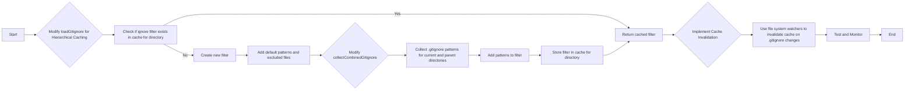

# Revised Plan for Fixing .gitignore Hierarchy

This document outlines the revised plan for addressing issues with `.gitignore` handling, specifically focusing on improving the caching mechanism for large, deep repositories and updating the `IgnorePatternsViewer.tsx` component to reflect the changes.

## 1. Problem Statement

The current caching mechanism for `.gitignore` patterns in `loadGitignore` is not efficient for large, deep repositories. This can lead to performance issues and incorrect ignore behavior. Additionally, the `IgnorePatternsViewer.tsx` component needs to be updated to reflect the hierarchical nature of the ignore patterns.

## 2. Revised Goal

Improve the caching mechanism for `.gitignore` patterns to ensure it works efficiently on large, deep repositories and update the `IgnorePatternsViewer.tsx` component to display the correct ignore patterns for a given file or directory.

## 3. Revised Plan

### 3.1. Hierarchical Caching

To address the caching issues, we will implement a hierarchical caching scheme. Instead of caching a single ignore filter for the entire repository, we will cache ignore filters for each directory. This will allow us to:

*   Reduce the size of each individual cache entry.
*   Invalidate the cache for a specific directory when its `.gitignore` file changes.
*   Potentially improve performance by only traversing the directory tree when necessary.

**Detailed Steps:**

1.  **Modify `loadGitignore`:**
    *   Instead of caching a single ignore filter for the entire `rootDir`, create a cache for each directory.
    *   When `loadGitignore` is called for a directory, check if an ignore filter already exists in the cache for that directory.
    *   If it exists, return the cached filter.
    *   If it doesn't exist, create a new filter, add the default patterns and excluded files, collect the `.gitignore` patterns for that directory (and its parent directories, if necessary), and add them to the filter.
    *   Store the new filter in the cache for that directory.
2.  **Modify `collectCombinedGitignore`:**
    *   Instead of collecting all `.gitignore` patterns in the entire repository, only collect the patterns for the current directory and its parent directories.
    *   This can be done by traversing up the directory tree from the current directory, collecting the `.gitignore` patterns in each directory.
3.  **Implement Cache Invalidation:**
    *   Implement a mechanism to invalidate the cache for a directory when its `.gitignore` file changes. This could be done using file system watchers.
4.  **Test and Monitor:**
    *   Test the improved caching mechanism on a large, deep repository to ensure that it works correctly and efficiently.
    *   Monitor the performance of the program after the changes to ensure that it does not negatively impact performance.

**Implementation Plan:**

### 3.2. Update `IgnorePatternsViewer.tsx`

The `IgnorePatternsViewer.tsx` component needs to be updated to reflect the hierarchical caching. This will require the following changes:

1.  **Modify the `patterns` prop:** The `patterns` prop should no longer be a simple object containing three arrays of strings. Instead, it should be a function that takes a file or directory path as input and returns an object containing the ignore patterns in effect for that path.
2.  **Update the `PatternSection` component:** The `PatternSection` component should be updated to call the `patterns` function with the appropriate file or directory path.
3.  **Implement a mechanism to specify the file or directory path:** The `IgnorePatternsViewer` component needs a way to specify the file or directory path for which the ignore patterns should be displayed. This could be done using a file input or a directory selection dialog.

## 4. Testing Strategy

1.  **Unit Tests:** Create unit tests for the caching mechanism and the `IgnorePatternsViewer.tsx` component.
2.  **Integration Tests:** Create integration tests to verify that the changes work as expected in different scenarios.
3.  **Regression Tests:** Run existing regression tests to ensure that the changes do not negatively impact existing functionality.
4.  **Performance Tests:** Measure the performance of the program before and after the changes to identify any potential performance bottlenecks.

## 5. Potential Side Effects and Considerations

*   **Memory Usage:** The hierarchical caching scheme could potentially increase memory usage, especially in large, deep repositories.
*   **Performance:** The changes could potentially impact performance, especially if the file system watchers are not implemented efficiently.
*   **Complexity:** The changes will increase the complexity of the codebase.

By following this revised plan, we can address the issues with `.gitignore` handling and ensure that the program works efficiently and correctly on large, deep repositories.