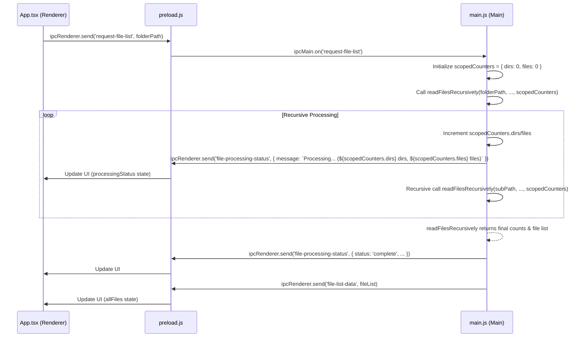

# DONE [X]

# Plan: Fix Inaccurate Progress Reporting During Directory Loading

## Problem

The progress reporting (number of directories searched, files processed) displayed during directory loading shows numbers that are too high. This suggests that the counters (`processedDirectories`, `processedFiles` in `main.js`) are not being reset correctly between operations or are accumulating incorrectly.

## Root Cause Analysis

The counters are currently global variables in `main.js`. While there is logic to reset them at the start of a new operation (`setupDirectoryLoadingTimeout`) and on cancellation (`cancelDirectoryLoading`), there might be edge cases (e.g., overlapping requests, specific error conditions) where the reset doesn't happen reliably, causing counts from previous operations to persist.

## Proposed Solution

Refactor the counter logic to avoid global state and ensure counts are scoped to individual directory loading operations.

1.  **Scope Counters:**

    - Modify the `readFilesRecursively` function signature in `main.js` to accept a counter object (e.g., `{ dirs: number, files: number }`).
    - Pass this counter object down through recursive calls, incrementing its properties directly instead of modifying global variables.
    - Return the updated counter object from recursive calls if necessary (though direct modification might suffice).

2.  **Initialize Counters:**

    - In the `ipcMain.on("request-file-list", ...)` handler in `main.js`, create a _new_ counter object initialized to `{ dirs: 0, files: 0 }` _every time_ the handler is invoked.
    - Pass this newly created object to the initial call of `readFilesRecursively`.

3.  **Update IPC Messages:**
    - Modify the `window.webContents.send("file-processing-status", ...)` calls within `readFilesRecursively` to use the values from the _scoped_ counter object passed into the function.

## Diagram

## Benefits

- **Accuracy:** Ensures progress counts are specific to the current operation.
- **Robustness:** Eliminates potential race conditions or state pollution from global variables.
- **Clarity:** Makes the data flow for progress reporting clearer within the code.
