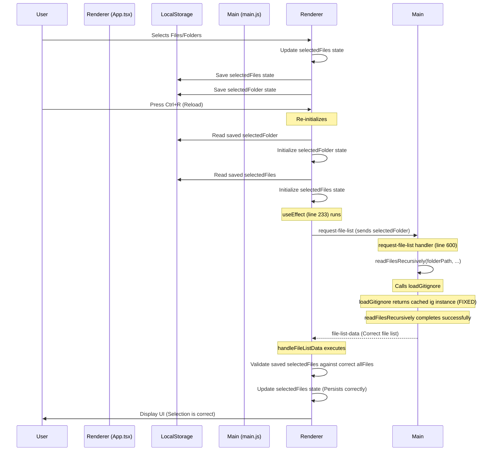

# FIXED! [X]

# Plan: Fix State Persistence Issue on Reload (Ctrl+R)

## Problem

When the user reloads the application (Ctrl+R), the selected files and folders are not persisted. Console logs show that `main.js` reports "Found 0 files" after reload, causing `App.tsx` to discard the saved selections. Terminal logs show a `TypeError: ignoreFilter.ignores is not a function` originating in `main.js` during the file scanning process after reload.

## Root Cause

The `TypeError` occurs because the `loadGitignore` function in `main.js` caches an object `{ ig: ignoreInstance, patterns: categorizedPatterns }` but returns the _entire object_ when retrieving from the cache (line 303). The `readFilesRecursively` function expects `loadGitignore` to return only the `ignoreInstance` (which has the `.ignores` method). When it receives the object instead, the call `ignoreFilter.ignores(...)` fails. This crash prevents `readFilesRecursively` from completing and sending the file list to the renderer.

## Solution

Modify the `loadGitignore` function in `main.js` to consistently return only the `ignore` instance (`ig`) whether it's newly created or retrieved from the cache.

1.  **File:** `main.js`
2.  **Function:** `loadGitignore`
3.  **Line:** 303
4.  **Change:** Modify the return statement for cached data.
    - **From:** `return ignoreCache.get(rootDir);`
    - **To:** `return ignoreCache.get(rootDir).ig;`

## Verification

1.  **Terminal:** The `TypeError: ignoreFilter.ignores is not a function` should no longer appear after reloading (Ctrl+R).
2.  **Application:** File selections made before reloading should be correctly persisted and displayed in the UI after the reload completes.

## Diagram

