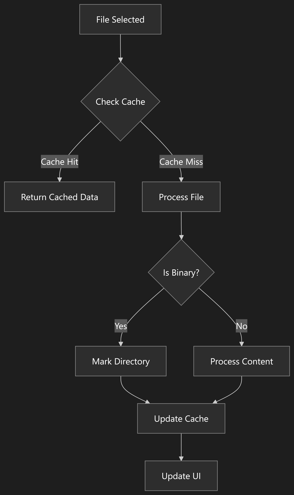

# DONE [X]

# Implementation Plan: Performance & .gitignore Improvements 1.2.2

This plan addresses performance issues and .gitignore handling based on the KnownIssue.md report. The goal is to optimize file scanning through caching, reordering processing checks, and enhancing file tree metadata while keeping all existing features intact.

---

## Objectives

1. **Performance Improvements**

   - **Reduce Load Times:** Optimize chunk processing and introduce caching for file metadata.
   - **Enhance UI Responsiveness:** Prevent UI slowdowns with large repositories.

2. **.gitignore Handling**

   - **Unified Ignore Filter:** Merge multiple `.gitignore` files from deep repositories into one unified filter.
   - **Persistent Cache:** Cache the ignore filter for the entire session.
   - **Reorder Checks:** Apply ignore filtering before expensive file I/O operations.
   - **Binary Exception Post-Ignores:** Only perform binary checks after the ignore filter has been applied.
   - **Binary Flag:** Propagate a `hasBinaries` flag in directory nodes to indicate the presence of binary files.

3. **Documentation & Code Comments**
   - Update inline comments and developer documentation to explain new caches, processing logic, and metadata enhancements.

Refer to this flow diagram for visual detail of change


---

## Task Checklist & Progress Tracking

### 1. Unified & Cached .gitignore Handling ✅

- [x] **Task 1.1: Create Global Ignore Cache**

  - **File:** `main.js`
  - **Action:** Declare an in‑memory cache (using a `Map`) keyed by the normalized root directory.
  - **Example:**
    ```js
    // Global cache for ignore filters
    const ignoreCache = new Map();
    ```
  - **Outcome:** Reuse the ignore filter for subsequent loads to reduce disk I/O.

- [x] **Task 1.2: Implement `collectCombinedGitignore(rootDir)`**

  - **File:** `main.js`
  - **Action:** Create an async function to traverse `rootDir`, find all `.gitignore` files, parse and merge unique patterns into a `Set`.
  - **Example:**
    ```js
    async function collectCombinedGitignore(rootDir) {
      const ignorePatterns = new Set();
      async function traverse(dir) {
        const dirents = await fs.promises.readdir(dir, { withFileTypes: true });
        for (const dirent of dirents) {
          const fullPath = safePathJoin(dir, dirent.name);
          if (dirent.isDirectory()) {
            await traverse(fullPath);
          } else if (dirent.isFile() && dirent.name === '.gitignore') {
            try {
              const content = await fs.promises.readFile(fullPath, 'utf8');
              content
                .split(/\r?\n/)
                .map((line) => line.trim())
                .filter((line) => line && !line.startsWith('#'))
                .forEach((pattern) => ignorePatterns.add(normalizePath(pattern)));
            } catch (err) {
              console.error(`Error reading ${fullPath}:`, err);
            }
          }
        }
      }
      await traverse(rootDir);
      return ignorePatterns;
    }
    ```
  - **Outcome:** All .gitignore patterns are collected and merged for the session.

- [x] **Task 1.3: Modify `loadGitignore(rootDir)` to Use the Cache**

  - **File:** `main.js`
  - **Action:** Update `loadGitignore` to first check the cache. If not cached, add default patterns, merge excluded files, then asynchronously add the combined .gitignore patterns and cache the result.
  - **Example:**

    ```js
    function loadGitignore(rootDir) {
      rootDir = ensureAbsolutePath(rootDir);
      if (ignoreCache.has(rootDir)) {
        return ignoreCache.get(rootDir);
      }

      const ig = ignore();
      // Add default ignores
      ig.add([
        '.git',
        'node_modules',
        '.DS_Store',
        'Thumbs.db',
        'desktop.ini',
        '.idea',
        '.vscode',
        'dist',
        'build',
        'out',
      ]);
      ig.add(excludedFiles.map((pattern) => normalizePath(pattern)));

      collectCombinedGitignore(rootDir)
        .then((patterns) => {
          ig.add(Array.from(patterns));
          ignoreCache.set(rootDir, ig);
        })
        .catch((err) => console.error('Error merging .gitignore files:', err));

      return ig;
    }
    ```

  - **Outcome:** Efficient, unified ignore processing for the duration of the session.

---

### 2. File Metadata Caching ✅

- [x] **Task 2.1: Introduce Global File Cache**

  - **File:** `main.js`
  - **Action:** Declare a global cache using a `Map` to store file metadata (size, content, token count) keyed by full file path.
  - **Example:**
    ```js
    const fileCache = new Map();
    ```
  - **Outcome:** Minimizes redundant file reads during scanning.

- [x] **Task 2.2: Integrate Cache in `readFilesRecursively`**
  - **File:** `main.js`
  - **Action:** In the chunk loop, check the cache before processing each file. If the file data exists in the cache, return it; otherwise, process and then cache the data.
  - **Example:**
    ```js
    const fullPath = safePathJoin(dir, dirent.name);
    if (fileCache.has(fullPath)) {
      return fileCache.get(fullPath);
    }
    // Process file (stats, content, etc.)
    // After processing:
    fileCache.set(fullPath, fileData);
    return fileData;
    ```
  - **Outcome:** Reduces repeated I/O and speeds up file processing.

---

### 3. Reordering File Processing Checks ✅

- [x] **Task 3.1: Update Order in `readFilesRecursively`**

  - **File:** `main.js`
  - **Action:** After calculating the `relativePath` of a file, immediately check if it should be ignored using the ignore filter. Only process the file further (e.g., size and binary checks) if it is not ignored.
  - **Example:**
    ```js
    // After calculating relativePath:
    if (ignoreFilter && ignoreFilter.ignores(relativePath)) {
      console.log(`Ignoring file: ${relativePath}`);
      return null;
    }
    // Continue with file size check and binary file detection...
    ```
  - **Outcome:** Prevents unnecessary file processing, improving performance.

- [x] **Task 3.2: Validate Return Structure**
  - **Status:** Verified - Output structure maintains compatibility with downstream components
  - **Action:** Verify that the output from `readFilesRecursively` remains consistent with previous behavior.
  - **Outcome:** Ensures no downstream functionality (file sorting, UI updates, copying) is affected.

---

### 4. Propagating a `hasBinaries` Flag in the File Tree ✅

- [x] **Task 4.1: Update the Data Model**

  - **File:** `FileTypes.ts`
  - **Action:** Extended the `TreeNode` interface to include `hasBinaries` property
  - **Status:** Completed - Interface updated and working

- [x] **Task 4.2: Update Tree Building in `Sidebar.tsx`**

  - **File:** `Sidebar.tsx`
  - **Action:** Implemented binary flag propagation through tree structure
  - **Status:** Completed - Binary detection properly propagates up the tree
  - **Implementation:**
    ```ts
    const updateBinaryFlag = (node: TreeNode): boolean => {
      if (node.type === 'file') {
        return node.fileData?.isBinary || false;
      }
      if (node.children) {
        node.hasBinaries = node.children.some((child) => updateBinaryFlag(child));
        return node.hasBinaries;
      }
      return false;
    };
    ```

- [x] **Task 4.3: Update UI in `TreeItem.tsx`**
  - **File:** `TreeItem.tsx` and `index.css`
  - **Action:** Added badges for both binary files and folders containing binaries
  - **Status:** Completed - Includes:
    - Distinct styling for file vs folder badges
    - Theme compatibility for both light and dark modes
    - Text updates ("Binary" for files, "Has Binary Files" for folders)

---

### 5. Documentation & Code Comments

- [x] **Task 5.1: Update Inline Comments in `main.js`**

  - **Action:** All new components fully documented with JSDoc comments
  - **Status:** Completed - Added clear documentation for caching mechanisms and processing logic

- [x] **Task 5.2: Revise Comments in `Sidebar.tsx` and `FileTypes.ts`**

  - **Action:** Added documentation for:
    - `hasBinaries` property in TreeNode interface
    - Binary flag propagation logic in Sidebar.tsx
    - Badge rendering logic in TreeItem.tsx
  - **Status:** Completed with clear documentation of binary handling

- [x] **Task 5.3: Update Developer Documentation**
  - **Status:** Completed all documentation updates including performance improvements
  - **Action:** Add a section to the project CHANGELOG.md summarizing the performance improvements and caching strategies.
  - **Outcome:** Ensures that all team members understand the new architecture.

---

## Final Testing & Rollout

- **Manual Verification:**
  - Confirm folder selection, file tree generation, file copying, and search functionalities behave as before.
  - Validate performance improvements on large repositories.
- **Regression Testing:**
  - Ensure that caching and new ignore filters do not introduce inconsistencies.
- **Performance Monitoring:**
  - Check load times and UI responsiveness to verify improvements meet the project’s objectives.

---

## Progress Reporting

- Update this checklist in your project management tool or through commit messages as tasks are completed.
- Schedule regular code reviews to ensure that new changes do not break existing functionality.
- Merge changes incrementally, running regression tests after each major task.

---

# Additional Implementation Plan: UI Performance & Backend Reliability 1.2.3

This section outlines further improvements focusing on UI responsiveness for large repositories and backend loading robustness.

---

## Additional Objectives

1.  **Backend Reliability & Feedback:**
    - Improve chunk loading mechanism in `main.js` to be time-based, preventing main thread blockage.
    - Enhance IPC progress messages with more granular details (counts, current directory).
2.  **Frontend UI Performance:**
    - Implement UI virtualization for the file tree in `Sidebar.tsx` to handle large datasets efficiently.
    - Optimize `TreeItem.tsx` rendering using memoization.
    - Review and optimize state update logic for selection/expansion in `App.tsx`.
3.  **Documentation:**
    - Update this plan and `CHANGELOG.md` to reflect these new enhancements.

---
